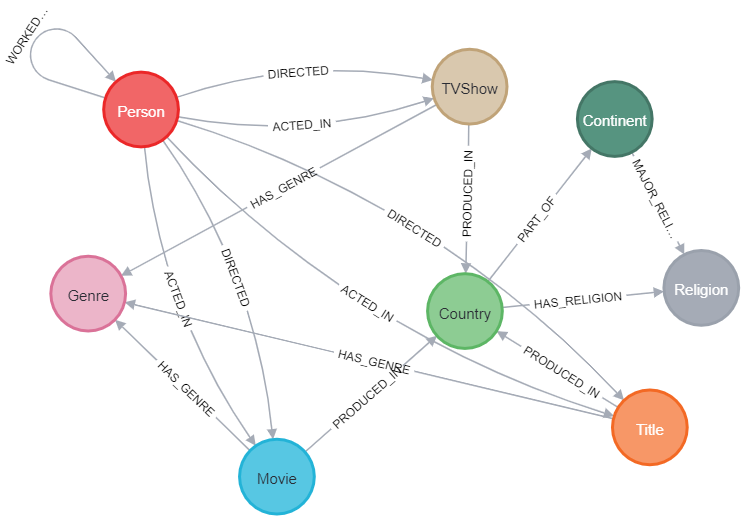
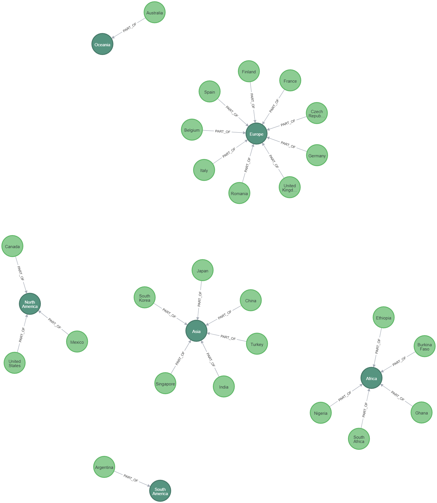

# Netflix Graph Analytics – Neo4j

## Project Overview

This project models and analyzes Netflix movies and TV shows using a graph database approach (Neo4j).  
The objective was to transform raw CSV data into a structured graph model and perform hypothesis-driven analytics using Cypher queries.

The project combines data engineering, graph modeling and analytical reasoning.

---

## Objectives

- Import and structure Netflix CSV dataset using Neo4j
- Implement dynamic node labeling (Movie / TVShow)
- Clean and validate inconsistent data
- Model entities and relationships in a graph structure
- Enrich data through additional relationships
- Test analytical hypotheses using Cypher queries

---

## Data Engineering Workflow

### 1. Data Import

- CSV-based import using `LOAD CSV`
- Creation of `Title` nodes
- Dynamic labeling (`:Movie`, `:TVShow`)
- Attribute normalization and type conversion

### 2. Data Cleaning

- Removal of invalid or empty country nodes
- Trimming and validation of text fields
- Relationship cleanup

### 3. Data Enrichment

- Creation of `AgeRating` nodes
- Relationship modeling using `MERGE`
- Schema refactoring and restructuring

Relevant implementation:
`queries/data-import-and-cleaning.cql`

---

## Graph Data Model

The dataset was transformed into a graph structure with the following core entities:

- Title
- Movie
- TVShow
- Genre
- Country
- Person
- Continent
- AgeRating

Relationships include:

- `DIRECTED_BY`
- `ACTED_IN`
- `PRODUCED_IN`
- `BELONGS_TO`
- `HAS_AGERATING`
- Hierarchical continent-country relationships

### Conceptual Model

---

## Analytical Hypothesis Example

### Hypothesis

The proportion of movies vs. TV shows differs significantly across countries, indicating distinct national production focuses.

### Query Implementation

The hypothesis was tested using aggregation, grouping logic and percentage calculations in Cypher.

See:
`queries/cypher-analysis-country-continent-distribution.cql`

The query performs:

- Aggregation of movies and TV shows per country
- Grouping of smaller countries into "Others"
- Global benchmark calculation ("Worldwide")
- Percentage distribution calculation
- Ordered comparative output

---

## Continent–Country Hierarchical Modeling

To enable structured geographic analysis, countries were modeled as belonging to continents.

This allows hierarchical aggregation and regional pattern analysis.

---

## Example Visualization

Distribution of movies vs. TV shows per country (percentage-based comparison):

---

## Technical Stack

- Neo4j Graph Database
- Cypher Query Language
- CSV Import (`LOAD CSV`)
- Data Cleaning & Validation
- Schema Refactoring
- Aggregation & Analytical Query Design
- Graph Visualization

---

## Key Learnings

- Graph databases enable multidimensional analysis beyond relational models
- Hierarchical modeling improves geographic and categorical analysis
- Cypher allows expressive aggregation and transformation logic
- Data cleaning is critical for consistent graph relationships
- Hypothesis-driven analysis improves analytical clarity

---

## Full Documentation

The complete project documentation and analytical background are available in the repository.

---
